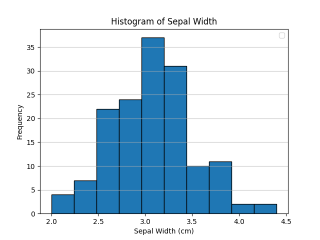
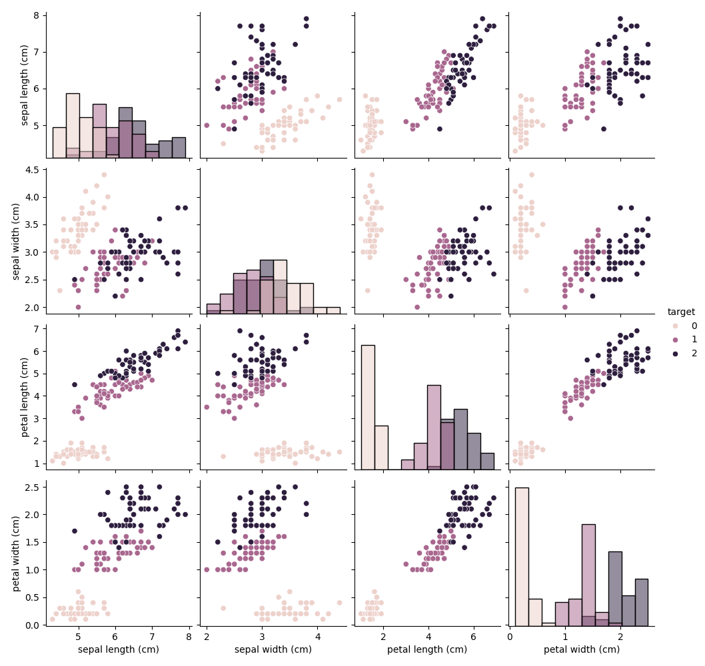
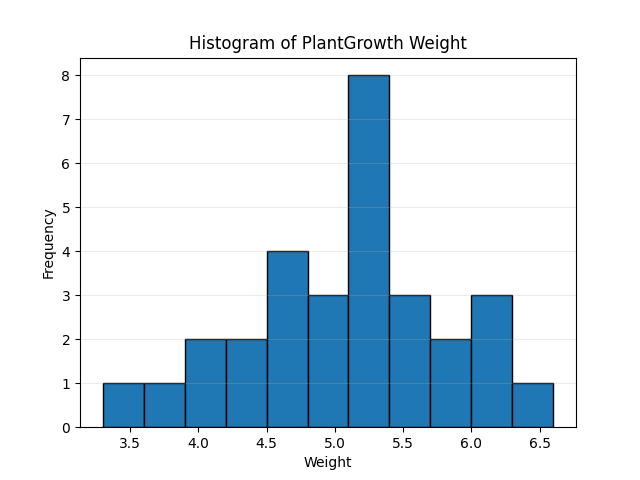
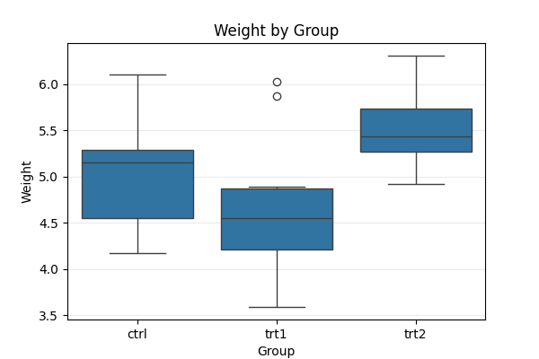
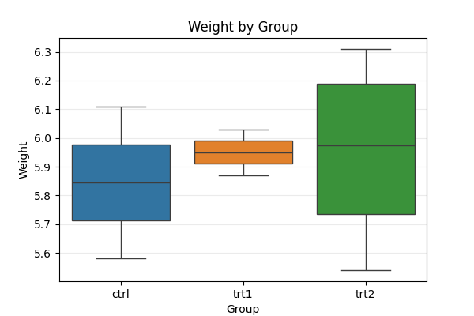

# Homework Week 3
## Alex Cory - GRAD505 


# Question 1
### 1.1\) Make a histogram of the variable Sepal Width
```
plt.hist(iris['sepal width (cm)'], bins=10, edgecolor='black')
plt.xlabel('Sepal Width (cm)')
plt.ylabel('Frequency')
plt.title('Histogram of Sepal Width')
plt.legend()
plt.grid(axis='y', alpha=0.75)
plt.show()
```



### 1.2\) Based on the histogram, I would expect the mean and median to be almost identical, with a slightly higher mean. This is due to the *slight* left skew to the data.

### 1.3) Compute the actual values of median and mean

```
print(iris['sepal width (cm)'].mean())
print(iris['sepal width (cm)'].median())
```
```
3.0573333333333337
3.0
```

### 1.4\) Only 27% of the flowers have a sepal width of higher than 3.3 cm

```
p73 = iris['sepal width (cm)'].quantile(1 - 0.27)
print(p73)
```
```
3.3
```

### 1.5\) Correlation pairplots
```
sns.pairplot(iris, hue='target', diag_kind='hist', diag_kws={'bins': 10})
plt.savefig(fname="Correlation_Iris")
plt.show()
```


Correlation matrix for exact $R^2$
```
iris.corr()
```
```
                   sepal length (cm)  sepal width (cm)  petal length (cm)  \
sepal length (cm)           1.000000         -0.117570           0.871754   
sepal width (cm)           -0.117570          1.000000          -0.428440   
petal length (cm)           0.871754         -0.428440           1.000000   
petal width (cm)            0.817941         -0.366126           0.962865   
target                      0.782561         -0.426658           0.949035   

                   petal width (cm)    target  
sepal length (cm)          0.817941  0.782561  
sepal width (cm)          -0.366126 -0.426658  
petal length (cm)          0.962865  0.949035  
petal width (cm)           1.000000  0.956547  
target                     0.956547  1.000000  
```

The pair with the highest correlation is petal length and petal width with a $R^2$ of .962

# Question 2
```
data = { "weight": [4.17, 5.58, 5.18, 6.11, 4.50, 4.61, 5.17, 4.53, 5.33, 5.14, 4.81, 4.17, 4.41, 3.59, 5.87, 3.83, 6.03, 4.89, 4.32, 4.69, 6.31, 5.12, 5.54, 5.50, 5.37, 5.29, 4.92, 6.15, 5.80, 5.26], "group": ["ctrl"] * 10 + ["trt1"] * 10 + ["trt2"] * 10}
PlantGrowth = pd.DataFrame(data)
```

### 2.1\) Histogram of weight

```
bins = np.arange(3.3, PlantGrowth['weight'].max() + 0.3, 0.3)
plt.figure()
plt.hist(PlantGrowth['weight'], bins=bins, edgecolor='black')
plt.xlabel('Weight')
plt.ylabel('Frequency')
plt.title('Histogram of PlantGrowth Weight')
plt.grid(axis='y', alpha=0.25)
plt.show()
```


2.2\) Boxplots separated by group

```
plt.figure(figsize=(6,4))
sns.boxplot(x='group', y='weight', data=PlantGrowth)
plt.xlabel('Group')
plt.ylabel('Weight')
plt.title('Weight by Group')
plt.grid(axis='y', alpha=0.25)
plt.show()
```



2.3\) A little less than half of control group weights are less than the minimum of trt2

2.4\)
```
min_trt2 = PlantGrowth.loc[PlantGrowth['group']=='trt2', 'weight'].min()
trt1 = PlantGrowth.loc[PlantGrowth['group']=='trt1']
percent_below = (trt1['weight'] < min_trt2).mean() * 100
print(f'Percent of treatment group 1 below the minimum of treatment group 2: {percent_below}')
```
```
Percent of treatment group 1 below the minimum of treatment group 2: 80.0
```
2.5\) Barplot of values above 5.5
```
above_55 = PlantGrowth.loc[PlantGrowth['weight'] > 5.5]
plt.figure(figsize=(6,4))
sns.boxplot(x='group', y='weight', data=above_55, palette='tab10', hue='group')
plt.xlabel('Group')
plt.ylabel('Weight')
plt.title('Weight by Group')
plt.grid(axis='y', alpha=0.25)
plt.show()
```
