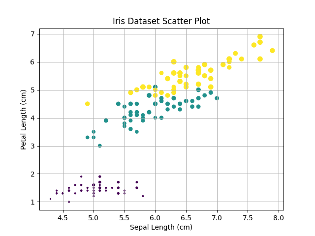

```
from sklearn import datasets
import numpy as np
import pandas as pd
import matplotlib.pyplot as plt
import math
```

```
iris = datasets.load_iris(as_frame=True)
iris = iris.frame #reassigning iris from a sklearn bunch to pandas df
type(iris)
```

```
iris.info()
```

```
<class 'pandas.core.frame.DataFrame'>
RangeIndex: 150 entries, 0 to 149
Data columns (total 5 columns):
 #   Column             Non-Null Count  Dtype  
---  ------             --------------  -----  
 0   sepal length (cm)  150 non-null    float64
 1   sepal width (cm)   150 non-null    float64
 2   petal length (cm)  150 non-null    float64
 3   petal width (cm)   150 non-null    float64
 4   target             150 non-null    int64  
dtypes: float64(4), int64(1)
memory usage: 6.0 KB
```

```
print("Rows in dataset: " + str(iris.shape[0]))
print("Columns in dataset: " + str(iris.shape[1]))
```
```
print("Rows in dataset: " + str(iris.shape[0]))
print("Columns in dataset: " + str(iris.shape[1]))
```
```
sub1 = iris.iloc[list(range(9))+[-1]]
print(sub1)
```
```
     sepal length (cm)  sepal width (cm)  petal length (cm)  petal width (cm)  \
0                  5.1               3.5                1.4               0.2   
1                  4.9               3.0                1.4               0.2   
2                  4.7               3.2                1.3               0.2   
3                  4.6               3.1                1.5               0.2   
4                  5.0               3.6                1.4               0.2   
5                  5.4               3.9                1.7               0.4   
6                  4.6               3.4                1.4               0.3   
7                  5.0               3.4                1.5               0.2   
8                  4.4               2.9                1.4               0.2   
149                5.9               3.0                5.1               1.8   

     target  
0         0  
1         0  
2         0  
3         0  
4         0  
5         0  
6         0  
7         0  
8         0  
149       2  
```
```
sub2 = iris.loc[
    iris['sepal width (cm)'] > 2.4,
    ['sepal length (cm)', 'sepal width (cm)', 'target']
]
sub2
```
```
	sepal length (cm)	sepal width (cm)	target
0	5.1	3.5	0
1	4.9	3.0	0
2	4.7	3.2	0
3	4.6	3.1	0
4	5.0	3.6	0
...	...	...	...
145	6.7	3.0	2
146	6.3	2.5	2
147	6.5	3.0	2
148	6.2	3.4	2
149	5.9	3.0	2
139 rows × 3 columns
```

```
Versicolor_Is_The_Best = (iris["target"] == 1).astype(int) * 100
Versicolor_Is_The_Best
```
```
0      0
1      0
2      0
3      0
4      0
      ..
145    0
146    0
147    0
148    0
149    0
Name: target, Length: 150, dtype: int64
```
```
sw = (iris['sepal width (cm)'])
print(sw.min())
print(sw.median())
print(sw.max())
```
```
2.0
3.0
4.4
```
```
counter = 0
for i in range(0, len(sw)):
    if(counter >= 100):
        print(i)
        break
    counter = counter + sw[i]
```
```
29
```

```
def cmtoin(cm):
    return cm/2.54
```
```
sw_in = iris['sepal width (cm)'].transform(lambda x: cmtoin(x))
```
```
sw_in[0:7]
```
```
0    1.377953
1    1.181102
2    1.259843
3    1.220472
4    1.417323
5    1.535433
6    1.338583
Name: sepal width (cm), dtype: float64
```

```
fig, ax = plt.subplots()
scatter = ax.scatter(x=iris['sepal length (cm)'],
y=iris['petal length (cm)'],
c=iris['target'],
s=iris['petal width (cm)']*20)
ax.set_xlabel('Sepal Length (cm)')
ax.set_ylabel('Petal Length (cm)')
ax.grid(True)
plt.title('Iris Dataset Scatter Plot')
plt.show()
```
